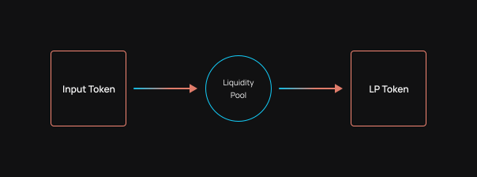

# Strategy Composition

Yield strategies are the fundamental building block of the OptyFi Protocol and its most compelling innovation.

Conceptually, yield strategies are generated dynamically based on the structure of DeFi liquidity pools. The building blocks for strategies are strategy steps and strategy sequences. The universe of possible strategy sequences together form a strategy graph.  

## Strategy Step

A strategy step is the fundamental building block of a strategy. A strategy step may consist of a deposit step or a borrow step. 

### Deposit Step 

Depositing an underlying token into a pool and receiving an LP token in return is considered a deposit strategy step. 

### Borrow Step

Depositing an underlying token into a pool as collateral and then borrowing an underlying token from a different pool is considered a borrow strategy step.

## Strategy Sequence

A strategy sequence is comprised of multiple strategy steps. 

If a token is deposited into a pool and the LP token you receive in return can be deposited into a second pool, then you can "string together" two strategy steps to form a two-step strategy sequence.

This process can be generalized into n-steps based on the condition `outputToken(step[n-1]) = inputToken(step[n])`. 

In today's DeFi reality, strategy sequences are usually limited to a maximum of two deposit steps or two deposit steps with a borrow step.

## Strategy Graph

The universe of possible strategy sequences forms a directed \(possibly cyclic\) graph which we refer to as the Strategy Graph. The nodes of the Strategy Graph represent liquidity pools and inbound edges represent deposits into those liquidity pools.

OptyFi's Strategy Graph is determined by liquidity pools integrated with the Protocol. Integrating a new liquidity pool to the Protocol creates a new node which potentially generates many more possible strategies.  

