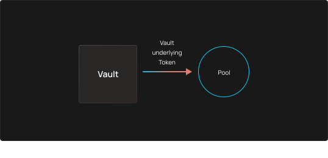
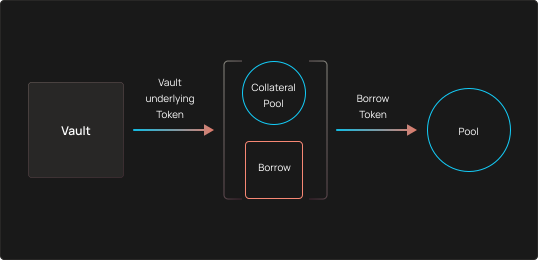
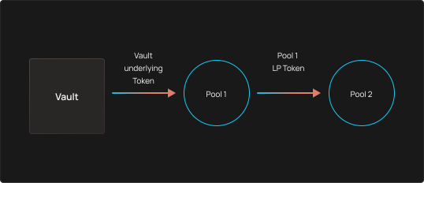
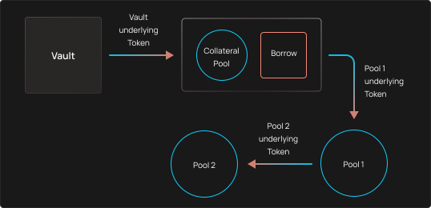

# Investment Strategies

In this section you will find diagrams and examples of the various Investment Strategy types supported by OptyFi.

## Zero-Step Strategy

Zero-Step strategies hold underlying assets in vaults and do not deposit them into liquidity pools.

For example, simply holding COMP tokens in a reward vault to earn more COMP!

## One-Step Strategy

One-Step strategies deposit the underlying asset of a vault into a single liquidity pool.

The following are some examples of One-Step strategies:

| Vault Type | Input Token | Liquidity Pool | Output Token |
| :--- | :--- | :--- | :--- |
| Core Vault | DAI | Compound | cDAI |
| LP Vault | cDAI | Cream | crDAI |
| Reward Vault | CRV | Curve | veCRV |

In the first example above, the vault takes DAI as the underlying asset, deposits DAI into Compound DAI lending pool and gets cDAI as the output token.

## One-Step with Borrow Strategy

One-Step with Borrow strategies deposit the underlying asset of a vault into a collateral pool as collateral, get a borrow token as a loan in return and then deposit the borrowed token into a liquidity pool.

The following is an example of a One-Step with Borrow strategy:

| Vault Type | Input Token | Collateral Pool | Borrow Token | Liquidity Pool | Output Token |
| :--- | :--- | :--- | :--- | :--- | :--- |
| Core Vault | DAI | Aave | USDC | dFORCE | dUSDC |

In the example above, the vault takes DAI as the underlying asset, deposits DAI into Aave DAI collateral pool, borrows USDC from Aave USDC borrow pool, deposits USDC into dFORCE USDC supply pool, and then gets dUSDC as the output token.

## Two-Step Strategy

Two-Step strategies deposit the underlying asset of a vault into a liquidity pool, get a liquidity pool \(LP\) token in return and then deposit the LP token into another liquidity pool.

The following is an example of a Two-Step strategy:

| Vault Type | Input Token | Liquidity Pool | LP Token | Liquidity Pool | Output Token |
| :--- | :--- | :--- | :--- | :--- | :--- |
| Core Vault | DAI | Curve | 3CRV | Yearn | g3CRV |

In the example above, the vault takes DAI as the underlying asset, deposits DAI into Curve DAI pool, gets 3CRV LP token, deposits 3CRV into Yearn 3CRV pool, and then gets g3CRV as the output token.

## Two-Step with Borrow Strategy

Two-Step with Borrow strategies deposit the underlying asset of a vault into a collateral pool as collateral, get a borrow token as a loan in return, deposit the borrowed token into a liquidity pool, get a liquidity pool \(LP\) token in return and then deposit the LP token into another liquidity pool.

The following is an example of a Two-Step with Borrow strategy:

| Vault Type | Input Token | Collateral Pool | Borrow Token | Liquidity Pool | LP Token | Liquidity Pool | Output Token |
| :--- | :--- | :--- | :--- | :--- | :--- | :--- | :--- |
| Core Vault | WETH | Aave | USDC | Curve | 3CRV | Curve | gUSD |

In the example above, the vault takes WETH as the underlying asset, deposits WETH into Aave WETH collateral pool, borrows USDC from Aave USDC borrow pool, deposits USDC into Curve USDC pool, gets 3CRV LP token, deposits 3CRV into Curve 3CRV pool, and then gets gUSD as the output token.

