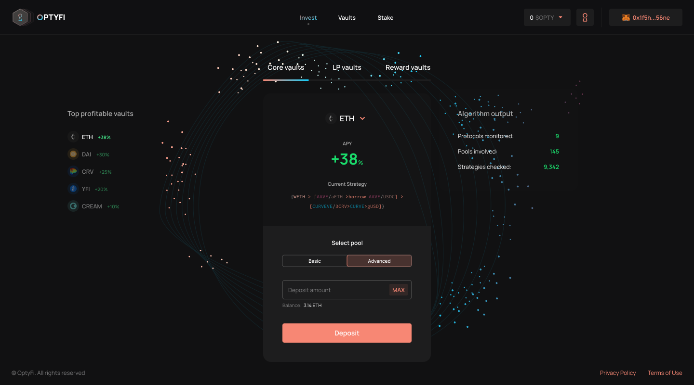

# Browse OptyFi Vaults

Now that you have funded and connected your wallet to the app, the next step is to search the available vaults that you can invest in.

To browse available vaults, navigate to the "Invest" page from the home screen. 

There you will find three vault types to choose from:

* **Core Vaults:** These vaults invest core tokens like DAI, USDC, WETH, and WBTC.
* **LP Vaults:** These vaults invest liquidity pool \(LP\) tokens like cDAI, aUSDC, and UNI-ETH-USDT.
* **Reward Vaults:** These vaults invest protocol reward tokens like COMP, BAL, and CRV for [Compound](https://compound.finance/), [Balancer](https://balancer.fi/), and [Curve](https://curve.fi/) respectively.

You should read through the short descriptions and characteristics of the vaults before you invest your funds.

