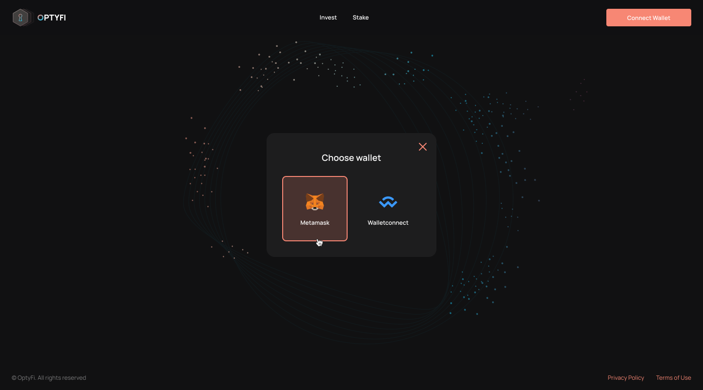
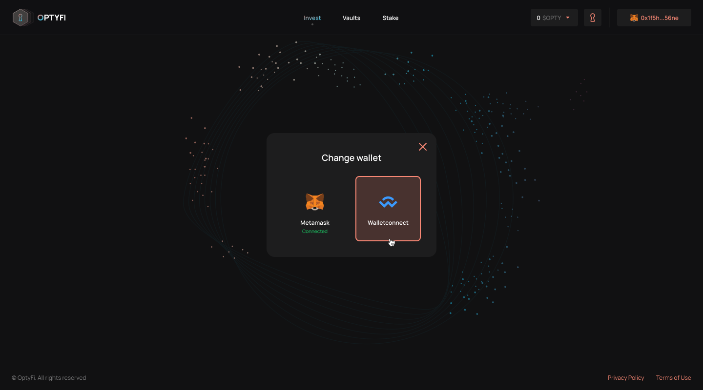

# Connect Your Wallet

In order to use OptyFi, you will need to fund and connect your Ethereum \(or Polygon\) wallet to the Protocol. You should have some ETH \(or MATIC\) tokens to pay for gas fees in addition to the underlying tokens \(e.g. DAI, USDC, LINK\) to be invested.

At launch, we will support [MetaMask](https://metamask.io/) and [WalletConnect](https://walletconnect.org/) with plans for more wallet options shortly after.

To get started, click the "Connect Wallet" button at the top of the screen and select your preferred wallet.

You will then be prompted to approve the connection on your wallet. Before approving, please make sure you are connected to the correct wallet account.

Once you are connected, you will be able to interact with the Protocol to browse available vaults, invest assets, stake OPTY, and so on.

Finally, you can disconnect the wallet and/or connect a different wallet at any time.

