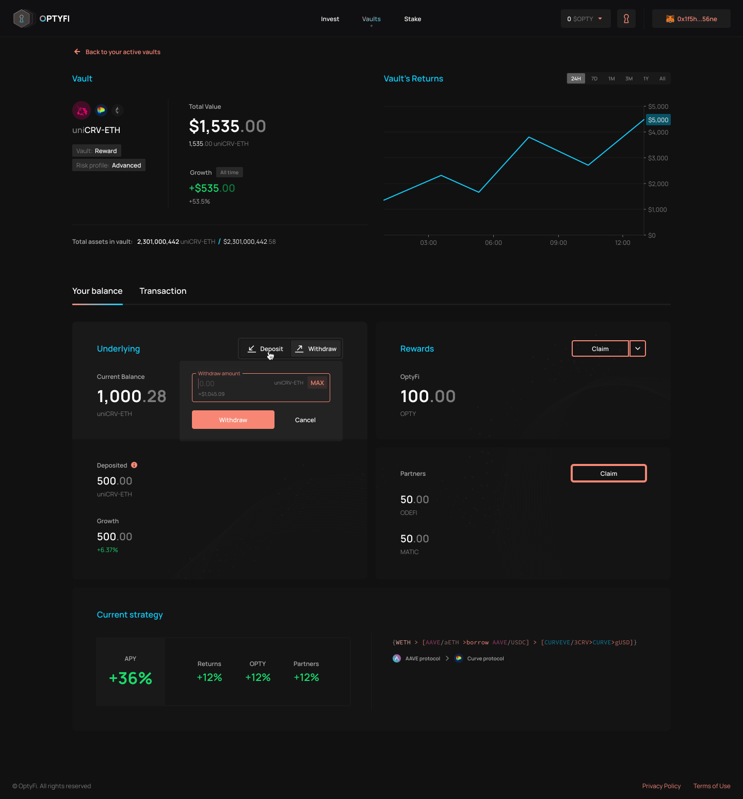

# Withdraw Assets

You can withdraw your assets from any vault at any time.

To do this, simply navigate to the "Vaults" page to view all your existing investments. You can then click "Withdraw" on the vault you want to liquidate.

After clicking "Withdraw", enter the amount you want to receive \(e.g. 500 DAI\) and confirm the transaction in your wallet.

Alternatively, you can also select any of the vaults you have invested in to see their current stats including total value, returns, claimable rewards, and so on, before deciding whether or not to withdraw your assets.

