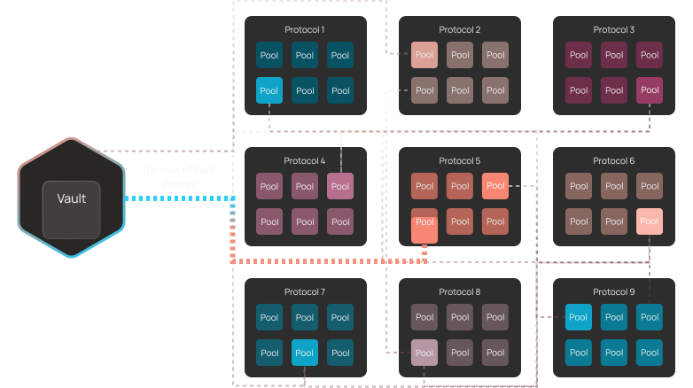

# How OptyFi Works

The OptyFi Protocol continuously monitors DeFi activity, predicting the yield of thousands of possible strategies across hundreds of liquidity pools.

The yield optimization model proceeds as follows:

1. **Dynamic Strategy Generation:** Strategies are dynamically composed based on the integrated protocols and blockchains.
2. **Optimization Engine:** Constantly monitors changing conditions across DeFi pools and scores the universe of possible strategies.
3. **Strategy Execution Engine:** Smart contracts can execute any valid yield strategy \(across integrated protocols/blockchains\) while enforcing risk constraints.
4. **Automated Vaults:** Vault assets are automatically and continuously routed to the most optimal strategy.
5. **Modular Design:** Specialist vaults optimize a single type of asset providing optimal yield for a specific risk level. Portfolio vaults allocate assets across specialist vaults, diversifying risk and providing optimal asset allocation.   

Capital never stays idle with OptyFi.

