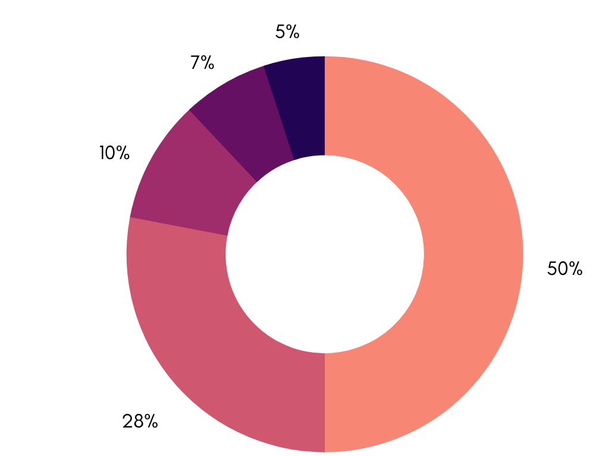

# OPTY Tokenomics

## Total Supply and Allocation

The OPTY token has a total supply of 100,000,000 allocated as follows:

| Category         | Allocation | Distribution                    |
| ---------------- | ---------- | ------------------------------- |
| Team + Advisors  | 28%        | 18 Months. Starting in Month 6. |
| Investors        | 3-10%      | 12 Months.                      |
| User Rewards     | 50%        | 24 - 60 Months.                 |
| Builder Rewards  | 10%        | 24 - 60 Months.                 |
| Treasury/IDO     | 2-9%       | TBD                             |

**Team + Advisors (28%):** Tokens will be allocated to **** the Core Team and Advisors who helped develop and launch the OptyFI Protocol.

**Investors (3-10%):** 3% of total supply is allocated to the friends and family investors who helped bootstrap development of the OptyFi Protocol. Should additional financing be necessary prior to launch, a maximum of 7% of total supply would be allocated to investors. Any portion of this category not allocated to investors would instead be re-allocated to the Protocol's Treasury/IDO (see below). &#x20;

**User Rewards (50%):** Tokens will be used to incentivize [Users](../protocol/participants.md#yield-users) to maintain assets in OptyFi vaults as well as to stake OPTY in OptyFi staking pools. The Protocol attempts to [optimize OPTY User Rewards distribution](adaptive-user-rewards-distribution.md) to achieve a balance between asset growth and Protocol value. This is accomplished by allowing Governance to set the rate at which OPTY tokens are distributed for User Rewards as well as the allocation of OPTY to the different OptyFi vaults and staking pools. &#x20;

**Builder Rewards (10%):** Tokens will be used to incentivize [Builders ](../protocol/participants.md#builders)(integrators, strategists, risk analysts and data providers) and other ecosystem contributors who will improve the utility of the OptyFi Protocol. Contributor rewards will be issued pursuant to approved Governance proposals or distributed by the Operators under discretion granted by Governance.

**Treasury/IDO (2-9%):** The treasury allocation will be used to fund the operations and administration of the Protocol. The treasury allocation may also be used towards an Initial DEX Offering (IDO).
