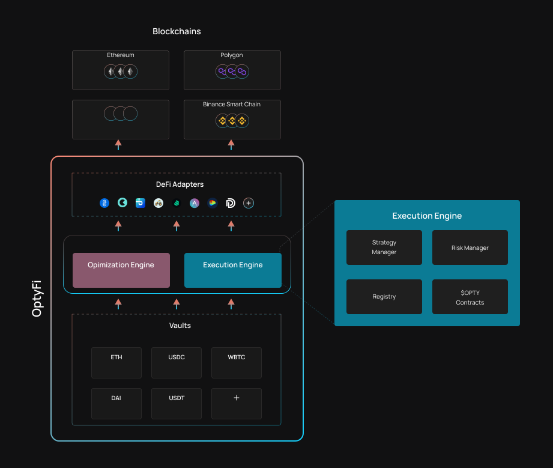

# Strategy Execution

OptyFi's smart contracts can execute generalized multi-step [yield strategies](strategy-composition.md) while enforcing [risk constraints](risk-framework.md). 

Each [vault](vaults.md) calls upon the [Strategy Manager](strategy-execution.md#strategy-manager) contract to execute the [optimal strategy](optimization-engine.md). The [Risk Manager](strategy-execution.md#risk-manager) contract ensures that only strategies matching the vault's risk profile can be executed. [DeFi Adapters](strategy-execution.md#defi-adapters) provide interfaces to the various DeFi protocols. 

## Architecture

OptyFi implements a "hub-and-spoke" architecture, where the core contracts \(e.g. Registry, Strategy Manager, Risk Manager\) form the central hub, and the vaults and DeFi Adapters form the spokes. This design makes OptyFi easily extensible, e.g. by adding vaults for new assets or adding DeFi adapters for new protocols and integrated liquidity pools.

## Strategy Manager

The Strategy Manager contract is able to generate code for any generalized multi-step strategy \(including strategies with a borrow step\). However, the Strategy Manager does not execute this code but rather returns this code to the vault, which then executes the strategy. This security feature ensures that, at each strategy step, assets \(input tokens and output tokens of the strategy\) always remain in the vault and are not transferred between OptyFi contracts. 

The Strategy Manager does not know how to interact with the various DeFi pools. For this purpose, it calls upon OptyFi's [DeFi Adapters](strategy-execution.md#defi-adapters). The Strategy Manager also calls upon the [Risk Manager](strategy-execution.md#risk-manager) to enforce risk constraints.  

## Risk Manager

Prior to returning the strategy execution code to a vault, the [Strategy Manager](strategy-execution.md#strategy-manager) calls upon the Risk Manager contract to check that the strategy about to be executed:

* only includes liquidity pools approved by governance.
* matches the vault's risk profile.

If these checks fail, the strategy will not be executed. 

The Risk Manager enables OptyFi to enforce risk constraints in real time. Consider the case where pool ratings are being provided by a credit risk oracle service and a given pool is downgraded from T1 to T2. In such a case, the Risk Manager will automatically be updated to "block" any strategies that do not allow T2 pools.  

## DeFi Adapters

While the Strategy Manager knows how to generate the code for a multi-step strategy, it does not know how to perform deposits, withdrawals or otherwise interact with specific liquidity pools. Protocol-specific DeFi Adapters contain code to interact with liquidity pools. In order to add the liquidity pools of a new protocol to the OptyFi system, a new DeFi adapter must be coded and deployed. 

DeFi Adapters are relatively easy to code and deploy. It is expected that a developer with knowledge of a liquidity generating protocol should be able to code the DeFi Adapter for that protocol within a week.
