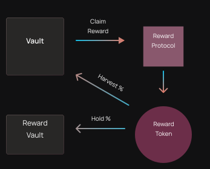

# Reward Strategies

Reward strategies are executed by OptyFi vaults as follows:

1. Vaults execute investment strategies that earn rewards from DeFi protocols.
2. Vaults claim reward tokens from the reward protocols \(for example, BAL from Balancer\).
3. X% of the reward tokens are converted to the vault's underlying assets and deposited back into the vaults.
4. Y% of the reward tokens are held in the reward vaults to earn more rewards.

The following table lists several examples of Vault Reward strategies:

| **Vault Type** | **Input Token** | **Reward Protocol** | **Reward Token** | **Harvest To Core Vault** | **Hold In Reward Vault** |
| :--- | :--- | :--- | :--- | :--- | :--- |
| Core Vault | DAI | Compound | COMP | 50% | 50% |
| Core Vault | DAI | Curve | CRV | 100% | 0% |

In the first example above, the vault claims COMP rewards from the Compound protocol and converts 50% of the rewards back to DAI to deposit into the DAI core vault. The remaining 50% is held in the COMP reward vault to earn more COMP tokens.

On the other hand, in the second example, the vault claims CRV rewards from the Curve protocol and converts 100% of the rewards back to DAI to deposit into the DAI core vault.
