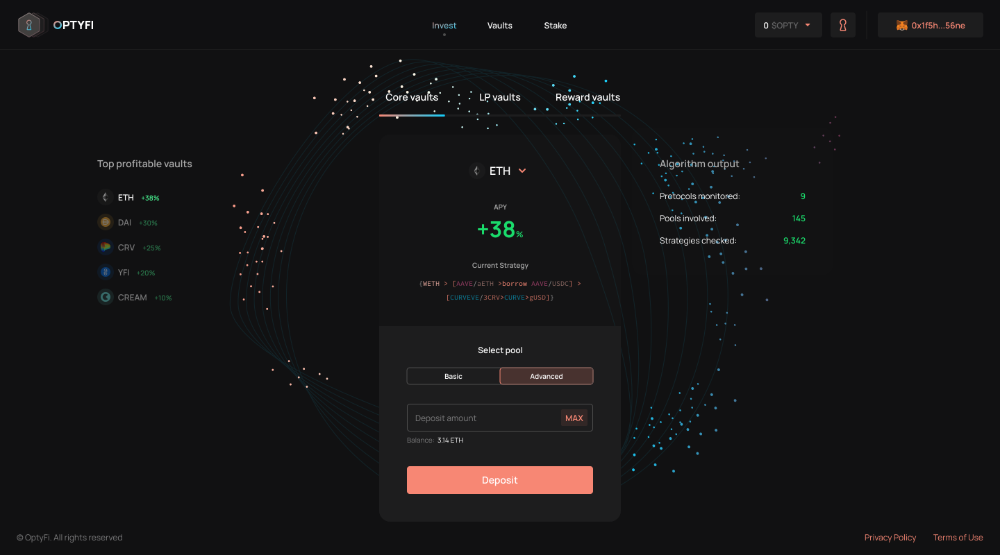

# Invest In Vaults

When you have searched the available vaults and decided the one to invest in, you can now deploy your capital to start earning yield.

To do this, you simply need to choose a vault type \(e.g. Core Vault\), the underlying asset to invest \(e.g. DAI\), and the preferred risk profile \(e.g. Basic\).


**NOTE:** You must have the underlying token of the chosen vault in your wallet. For example, you must have DAI in your wallet in order to invest in the DAI Core Vault.


After selecting the vault type, input token and risk profile, you can now enter the amount you want to invest \(e.g. 1,000 DAI\), click "Deposit", and confirm the transaction in your wallet.

Voila! You are now earning the most optimal yield on DAI in the whole of DeFi.

