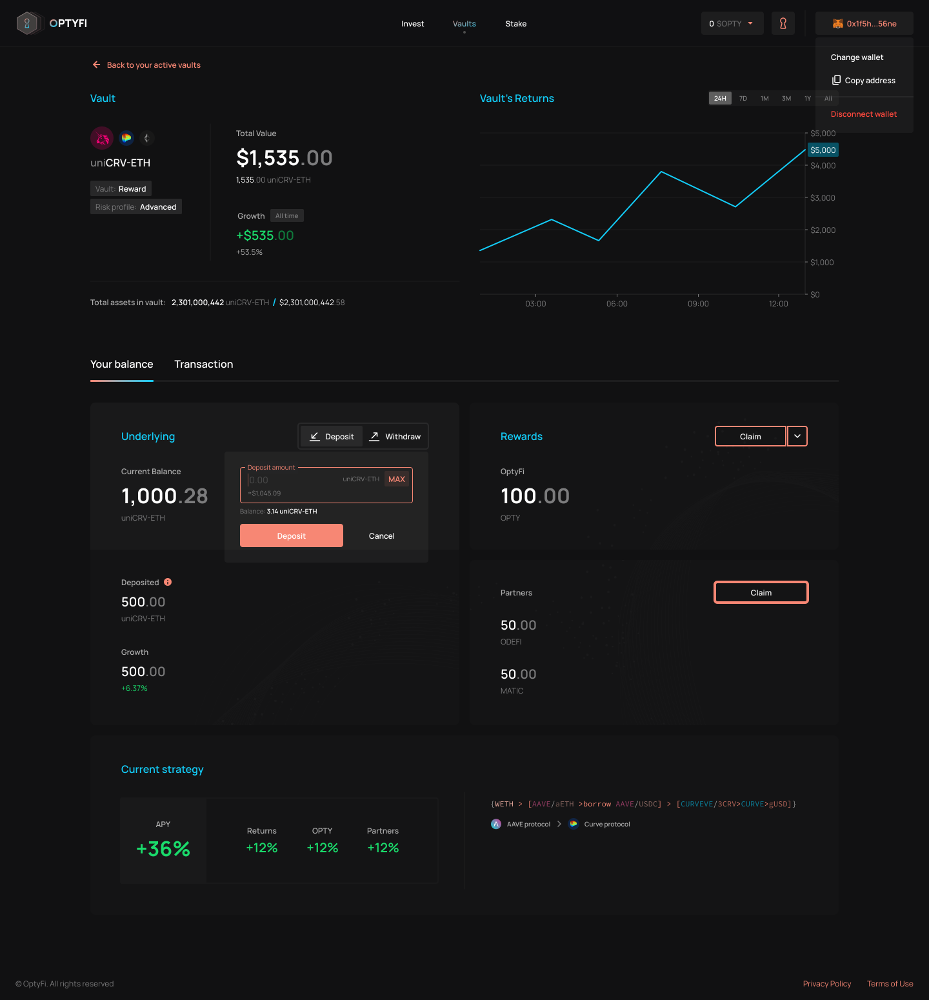

# Deposit Assets

The first interaction you will have with OptyFi Vaults as an investor will be to deposit assets in order to earn yield.

As earlier stated [here](../getting-started/invest-in-vaults.md), there are several vault types, underlying assets and risk profiles to choose from. You will need to navigate to the "Invest" page to browse through and select from the available options.

Once you have selected your preferred vault details \(including vault type, underlying asset and risk profile\), all you need to do is enter the amount you want to invest \(e.g. 1,000 DAI\), click "Deposit" and then confirm the transaction in your wallet.

Alternatively, if you have invested before, you can also go to the "Vaults" page to view a list of all the vaults you are currently invested in. From there, you can select any of them to see their current stats before depositing more capital.

