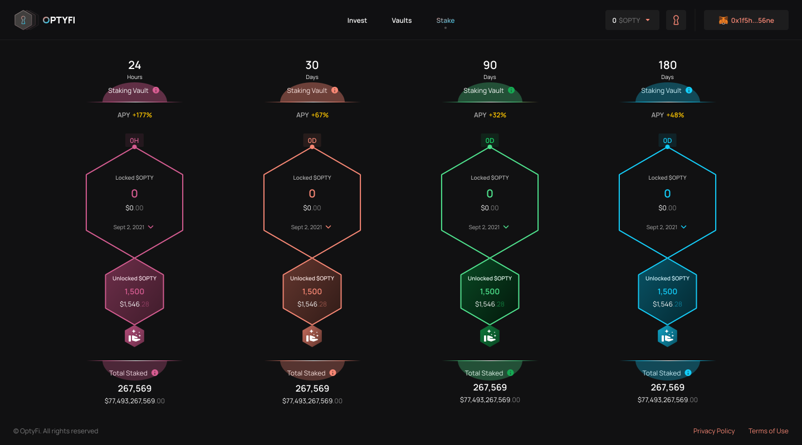

# Stake OPTY

In addition to earning OPTY tokens for providing liquidity and investing in OptyFi vaults, you will also be able to earn more OPTY by staking your OPTY tokens into multiple staking pools with different lock-in periods. By depositing into pools with longer lock-in periods, you can receive a higher rate of return on your OPTY.

Also, you will need to stake your OPTY in order to participate in Governance voting.

To stake your OPTY tokens, navigate to the "Stake" page, select a staking pool with your preferred lock-in period, enter the amount to stake \(e.g. 100 OPTY\), click "Stake OPTY", and then confirm the transaction in your wallet.

