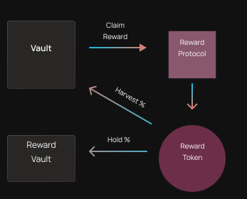

# 收益策略

收益策略由OptyFi机枪池执行，如下所示：

1. 机枪池执行投资策略，从DeFi协议中赚取收益。
2. 机枪池从收益协议中领取收益代币。（如，Balancer的BAL代币）
3. X%的收益代币转换为机枪池基础资产并存入机枪池。
4. Y%的收益代币存放在收益池中以获得更多收益。

以下是机枪池收益策略的示例：

|       |      |          |      |        |        |
| ----- | ---- | -------- | ---- | ------ | ------ |
| 机枪池类型 | 输入令牌 | 收益协议     | 收益代币 | 回流到核心池 | 存入到收益池 |
| 核心池   | DAI  | Compound | COMP | 50%    | 50%    |
| 核心池   | DAI  | Curve    | CRV  | 100%   | 0%     |

在上面的第一个示例中，机枪池从Compound协议中领取COMP奖励，并将50%的收益转换回DAI，存入DAI核心池。剩余的50%收益存入到COMP收益池中，以赚取更多COMP代币。

另一方面，在第二个示例中，机枪池从Curve协议领取CRV代币奖励，并将100%的收益代币转换回DAI，并存入DAI核心池。
