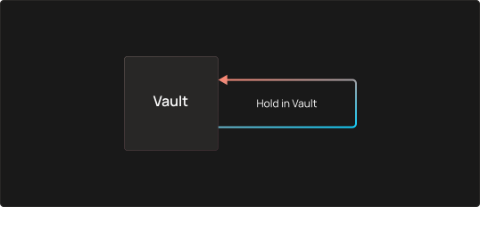

# 投资策略

在本节中，您将找到OptyFi支持的各种投资策略类型的图表和示例。

## 零步策略

零步策略就是将基础资产存放在机枪池里，不将其存入到流动性池中。

例如，只需在收益池中持有COMP代币即可赚取更多COMP！

## 一步策略

一步策略就是将一个机枪池的基础资产存入到一个流动性池中。

以下是一步战略的一些示例：

|       |      |          |       |
| ----- | ---- | -------- | ----- |
| 机枪池类型 | 输入令牌 | 流动性池     | 输出令牌  |
| 核心池   | DAI  | Compound | cDAI  |
| LP池   | cDAI | Cream    | crDAI |
| 奖励池   | CRV  | Curve    | veCRV |

在上面的第一个示例中，机枪池将DAI作为基础资产，把DAI存入Compound DAI的借贷池，获取输出令牌cDAI。

## 两步策略

两步策略将保险库的基础资产存入流动性池，作为回报获得流动性池（LP）代币，然后将LP代币存入另一个流动性池。

 (2).svg>)

以下是两步策略的示例：

|       |      |       |       |       |       |
| ----- | ---- | ----- | ----- | ----- | ----- |
| 机枪池类型 | 输入令牌 | 流动性池  | LP 令牌 | 流动性池  | 输出令牌  |
| 核心池   | DAI  | Curve | 3CRV  | Yearn | g3CRV |

在上面的示例中，机枪池将DAI作为基础资产，将DAI存入Curve的DAI池，获得LP令牌3CRV，将3CRV存入Yearn的3CRV池，然后获得输出令牌g3CRV。

## 两步策略（包含借入策略）

借入策略将机枪池的基础资产作为抵押品存入抵押池，以此获得借入令牌，再将借入令牌存入流动性池，获得流动性池（LP）令牌作为回报，然后再将LP令牌存入到另一个流动性池。

以下是两步策略（包含借入策略）的示例：

|       |      |      |      |       |      |       |      |
| ----- | ---- | ---- | ---- | ----- | ---- | ----- | ---- |
| 机枪池类型 | 输入令牌 | 抵押池  | 借入令牌 | 流动性池  | LP令牌 | 流动性池  | 输出令牌 |
| 核心池   | WETH | Aave | USDC | Curve | 3CRV | Curve | gUSD |

在上述示例中，机枪池将WETH作为基础资产，将WETH存入Aave的WETH抵押池，然后从Aave的USDC借入池借入USDC，将USDC存入Curve的USDC池，获得LP代币3CRV，将3CRV存入Curve的3CRV池，最终获得输出令牌gUSD。
