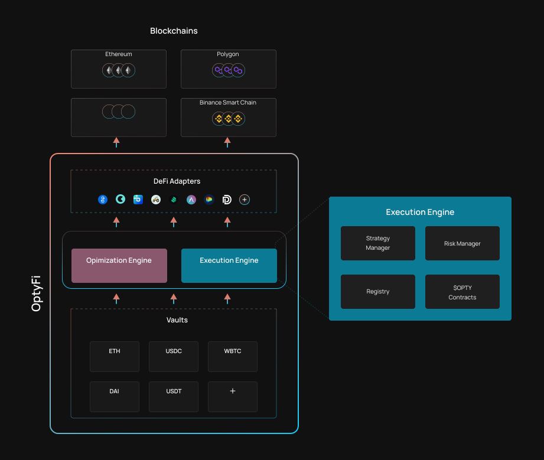

# 策略执行

OptyFi的智能合约可以在执行风险约束的同时执行广义多步骤收益率策略。

每个保险库都要求Strategy Manager合约执行最佳策略。Risk Manager合约确保只能执行与保险库风险状况相匹配的策略。DeFi适配器为各种DeFi协议提供接口。

## 结构

OptyFi实施了一种“hub-and-spoke”架构，核心合约（注册、策略经理、风险经理）构成中心中心，保险库和DeFi适配器构成辐条。这种设计通过为新资产添加保险库或为新协议和集成流动性池添加DeFi适配器，使OptyFi易于扩展。

## 策略经理

Strategy Manager合约能够为任何通用的多步骤策略（包括具有借入步骤的策略）生成代码。但是，Strategy Manager不执行此代码，而是将此代码返回到vault，然后由vault执行策略。

