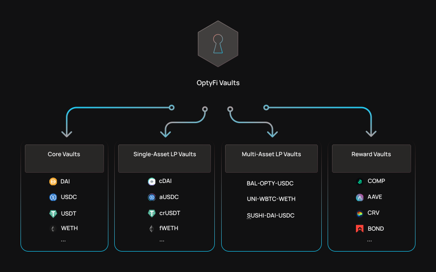

# 机枪池

机枪池是OptyFi智能合约，用户将资产存入其中，从而OptyFi可以将这些资产部署到最佳的收益策略上。机枪池通过让用户共同分担Gas成本的方式来提高用户的利润，同时还能有利于收益策略的频繁转换。

每个机枪池都有一个由其基础令牌（即，令牌用户将存入保险库）确定的机枪池类型。每个机枪池还与特定的风险状况相关联，该风险状况决定了机枪池可以和不能将资产部署到哪些战略中。

## 机枪池类型

|       |                                          |
| ----- | ---------------------------------------- |
| 类型    | 底层令牌示例                                   |
| 核心机枪池 | DAI, USDC, USDT, WBTC, WETH              |
| LP机枪池 | cDAI, aUSDC, UNI-ETH-USDT, BAL-OPTY-USDC |
| 奖励机枪池 | COMP, BAL, CRV                           |

LP机枪池可以接受cDAI或aUSDC等单资产LP代币以及UNI-ETH-USDT等多资产LP代币。

## 部署的机枪池

每个基础资产和风险组合将有一个单独的机枪池。

上线后（ETA 2021年7月），将部署以下保险库。

|                |          |
| -------------- | -------- |
| 基础资产           | 风险评估     |
| DAI            | RP1, RP2 |
| USDC           | RP1, RP2 |
| USDT           | RP1, RP2 |
| WETH           | RP1, RP2 |
| WBTC           | RP1, RP2 |
| BAL-OPTY-USDC  | RP0      |
| BAL-ODEFI-USDC | RP0      |

例如，DAI-RP1保险库将接受DAI作为输入令牌，然后将DAI部署到满足RP1风险状况的各种策略中。
