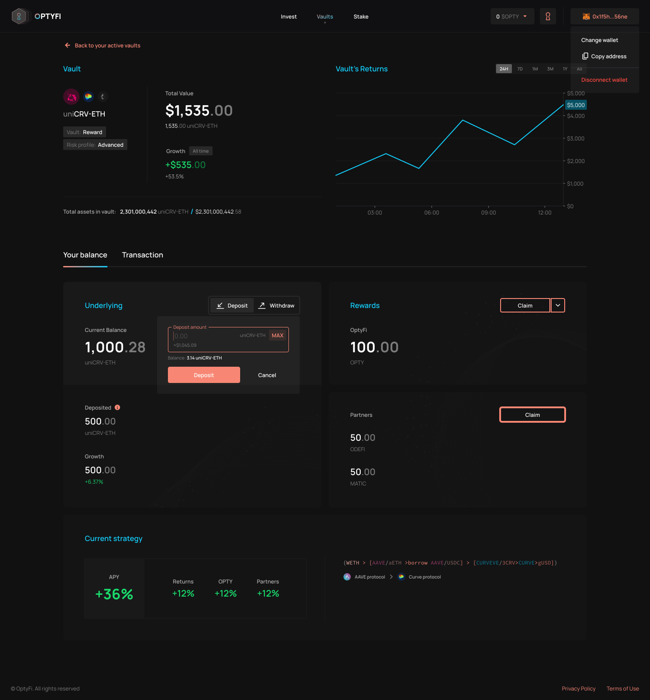

# 存款

作为投资者，您与OptyFi Vault的第一次交互将是存入资产以赚取收益。

[如前所述](../xin-shou-ru-men/tou-zi-ji-qiang-chi.md)，有几种保险库类型、基础资产和风险状况可供选择。您需要导航到“Invest（投资）”页面，浏览并从可用选项中进行选择。

选择首选的保险库详细信息（包括保险库类型、基础资产和风险状况）后，您只需输入您想要投资的金额（例如1000 DAI），单击“存款”，然后在钱包中确认交易。

或者，如果您以前投资过，也可以转到“Vaults（保险库）”页面，查看您当前投资的所有保险库的列表。从那里，你可以选择其中任何一个，在存入更多资金之前查看他们当前的统计数据。

