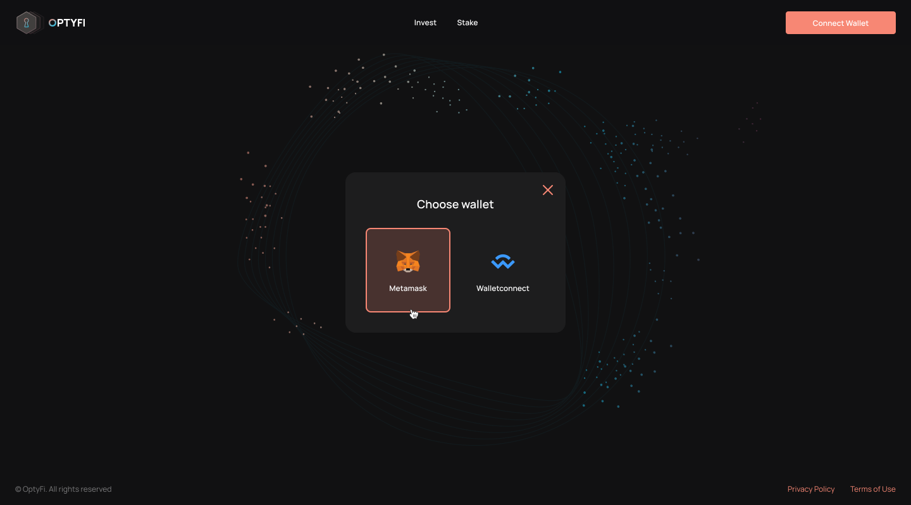
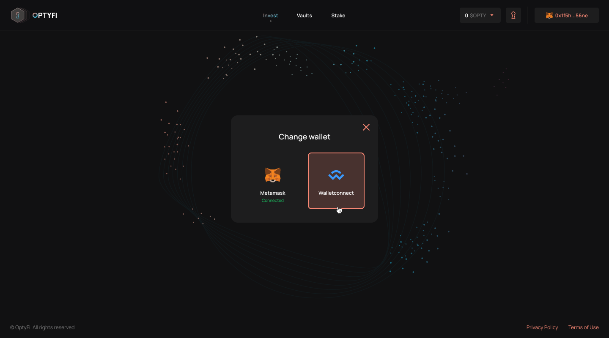

# 连接钱包

为了使用OptyFi，您需要在以太链（或马蹄链）上链接你的钱包并连接到OptyFi协议。除了要存入的基础代币（如DAI、USDC、LINK）外，你还需要有一些ETH（或MATIC）代币用于支付gas。 然后你会被提示批准你的钱包上的连接。在批准之前，请确保你已经连接到正确的钱包账户。

上线后，我们将支持MetaMask和WalletConnect，并计划不久后提供更多钱包选项。

开始时，请单击屏幕顶部的“Connect Wallet”按钮，然后选择您喜欢的钱包。

然后你会被提示批准你的钱包上的连接。在批准之前，请确保你已经连接到正确的钱包账户。

一旦你连接成功，你将能够使用opty协议，浏览可用的保险库，存入资产，质押OPTY，等等。

最后，你可以在任何时候断开钱包连接或连接一个不同的钱包。

